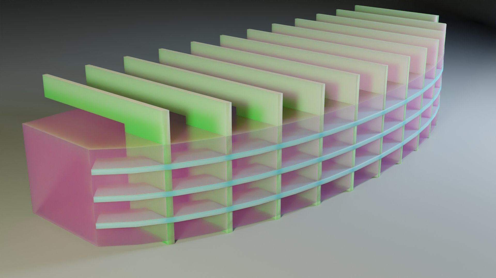
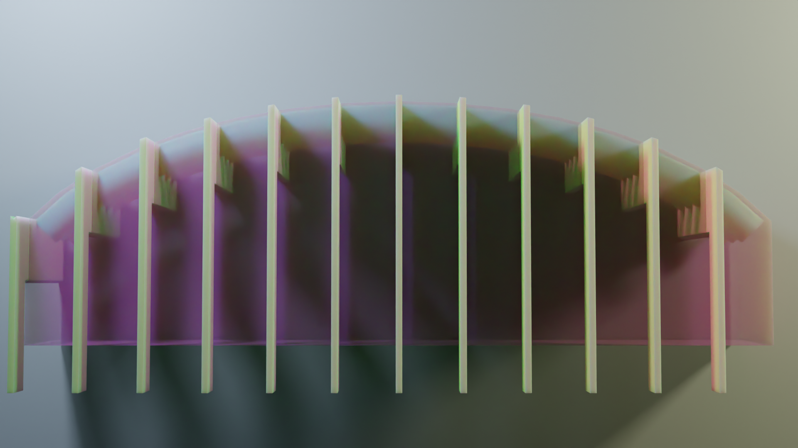
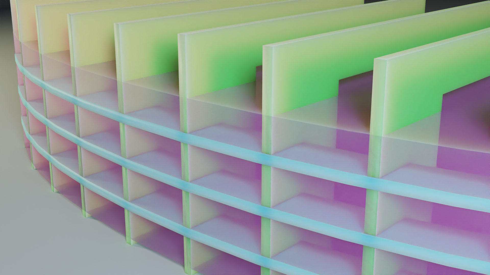
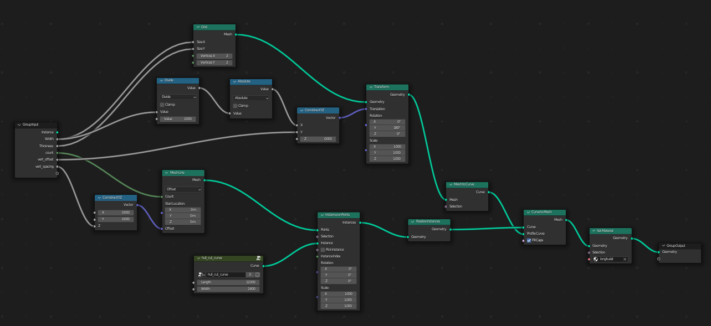
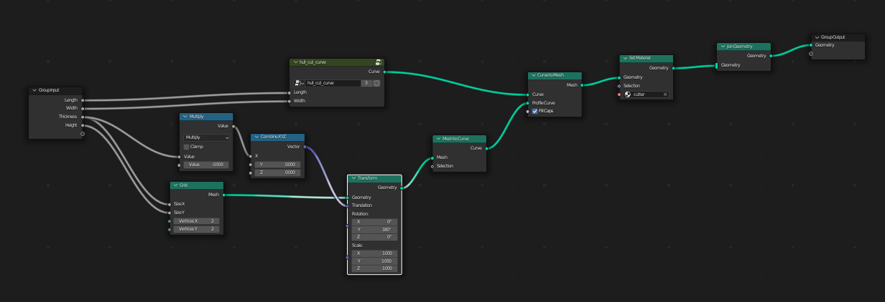

# blender_boat_nodes
Blender 3.0 Geometry Nodes based boat generator

This is the first attempt to try to model boat hull structure components using Blender 3.0 Geometry Nodes.

In the future this may work together with [bpyhullgen](https://github.com/edzop/bpyhullgen) or they may merge into one project... 

This is work in progress and experimental. 

See related project: [bpyhullgen](https://github.com/edzop/bpyhullgen)
