# blender_boat_nodes
Blender 3.2 Geometry Nodes based boat generator

This is an attempt to try to model boat hull structure components using Blender 3.2 Geometry Nodes

Please visit the [WIKI](https://github.com/edzop/bpyhullgen) for more documentation!

https://github.com/edzop/blender_boat_nodes/wiki

## Example node setup 
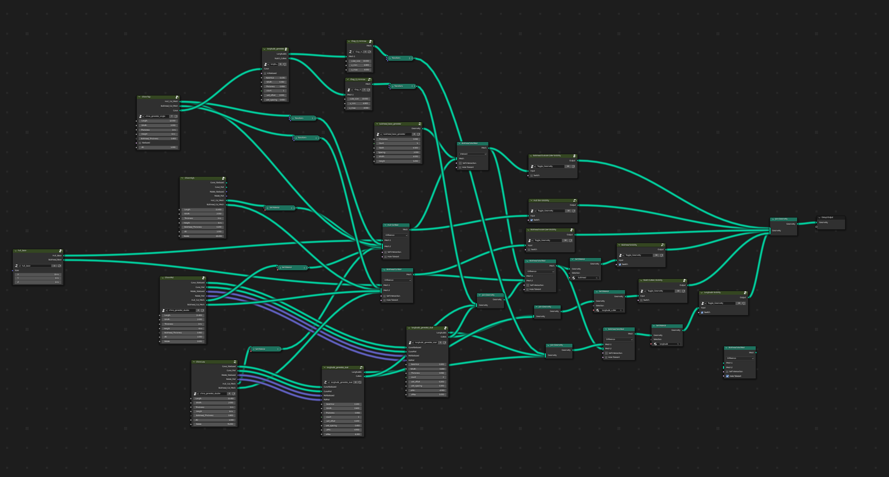

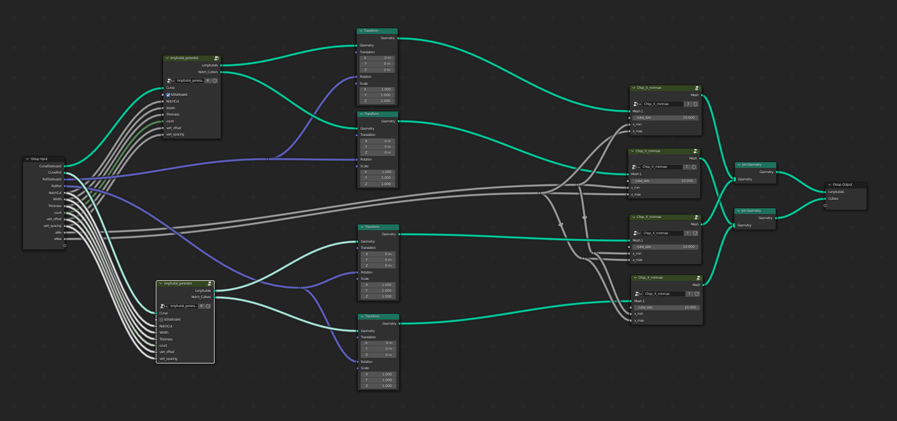

## Rendered boat hull with external skin
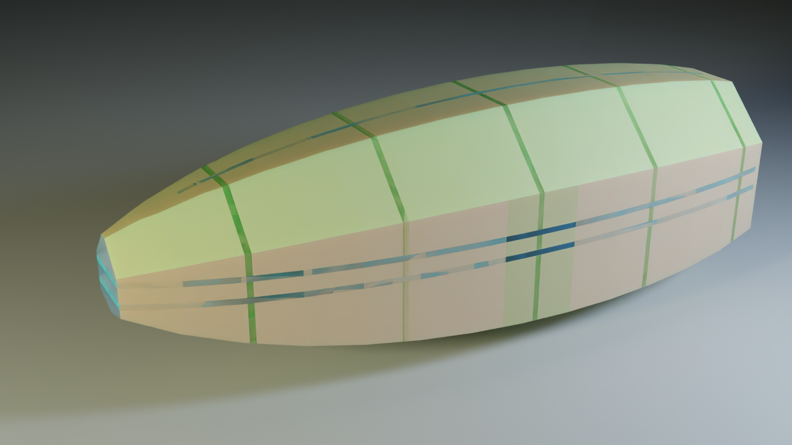
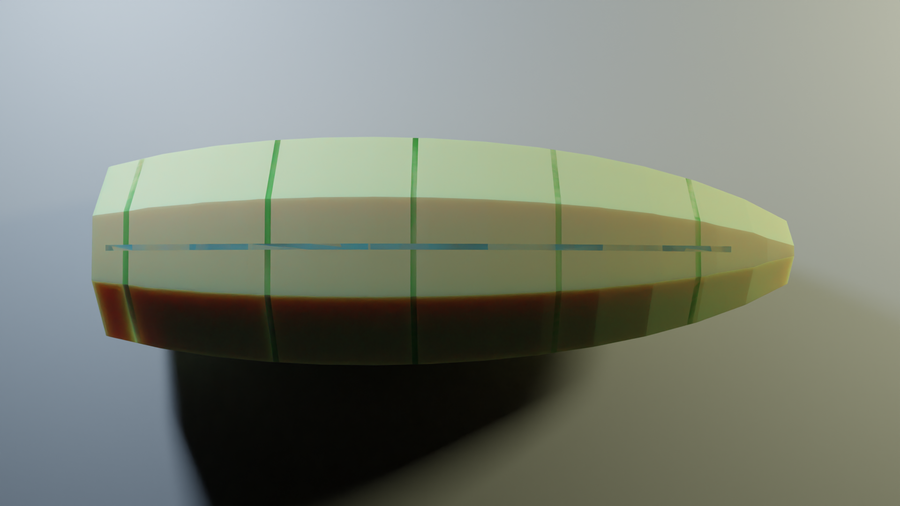
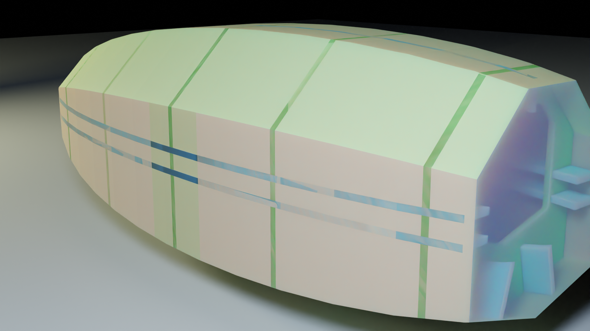

## Sample render showing bones
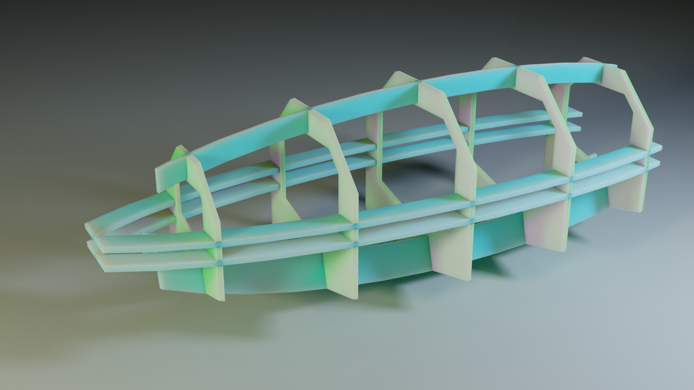
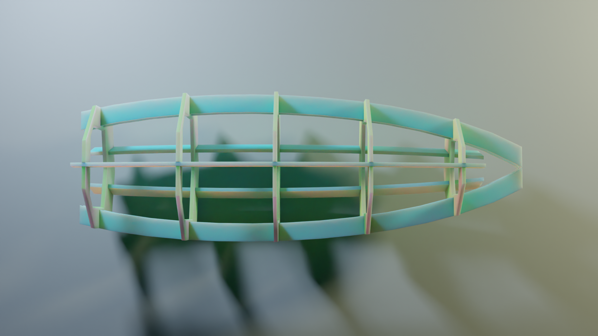
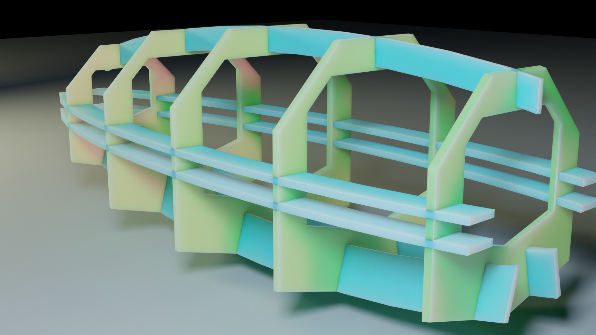

## Proof of concept real world production
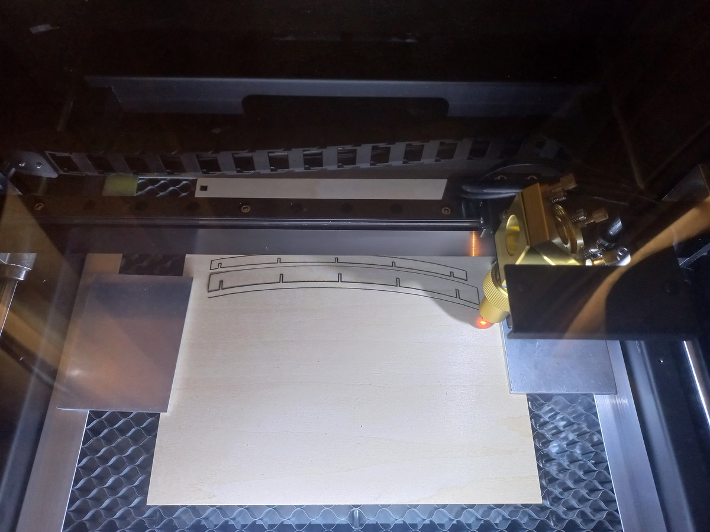

## Laser cutting plywood
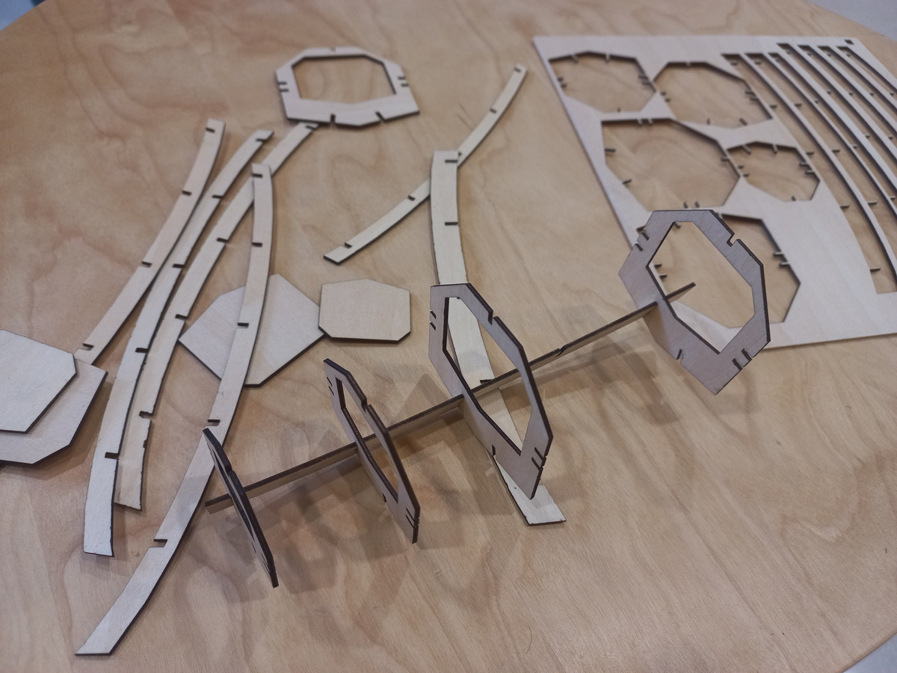
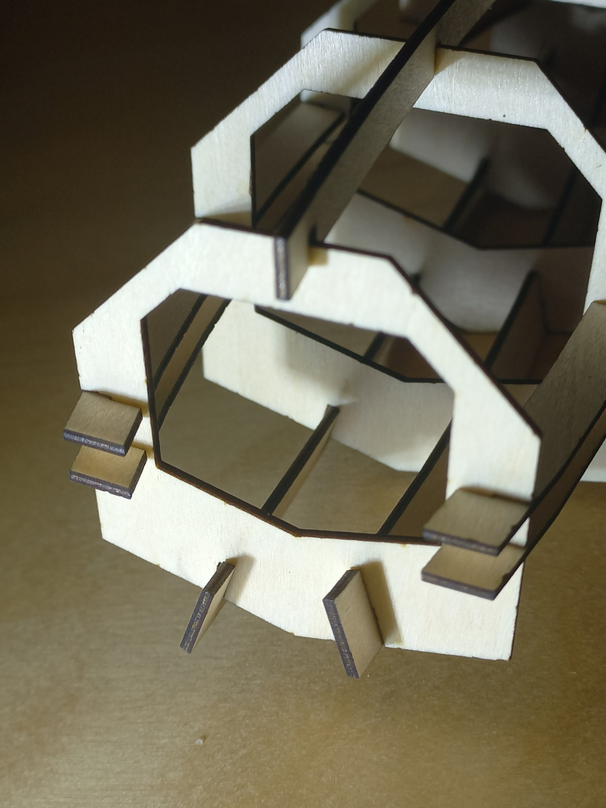

## View of notches self jigging assembly
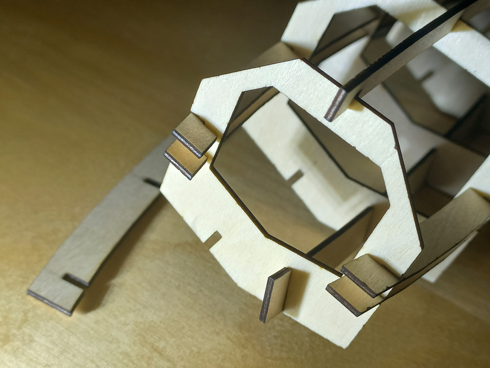
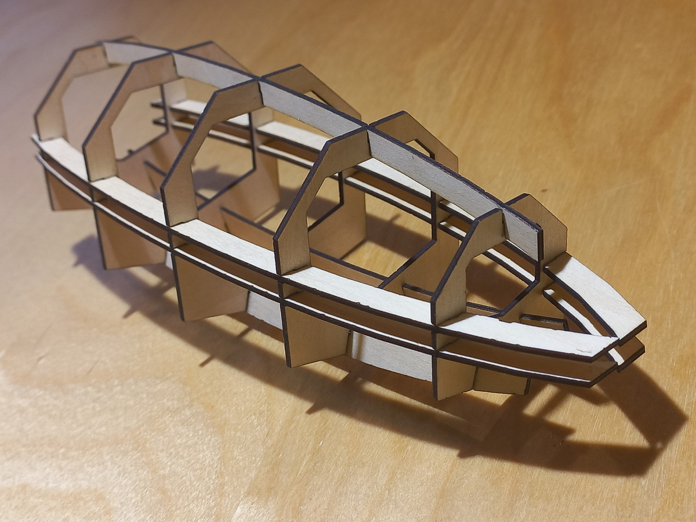
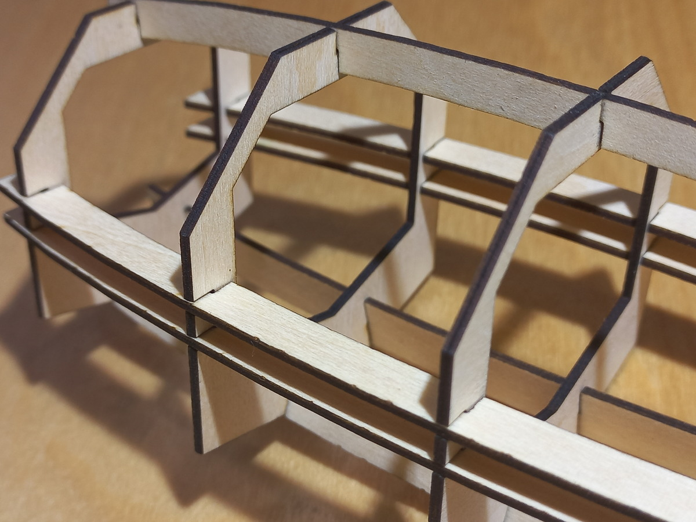

## Todo 
- Documentation [in progress](https://github.com/edzop/bpyhullgen)

- More unit tests
- More example files

In the future this may work together with [bpyhullgen](https://github.com/edzop/bpyhullgen) or they may merge into one project... 

This is work in progress and experimental. 

If you want to play with it just clone this repository and open the v3 blend file in blender 3.2

See related project: [bpyhullgen](https://github.com/edzop/bpyhullgen)
